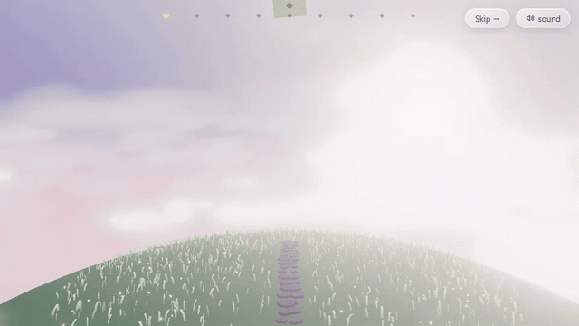

# Alice's Wonderland 🐾☁️

> An interactive 3D story-portfolio. A small cat wanders a cloud kingdom where
> every island is a chapter of Alice Wang's life — sometimes the road ahead is
> clear, sometimes the view is blocked.



**Live:** [ma-vie.alicewang0022.workers.dev](https://ma-vie.alicewang0022.workers.dev)

V1 built in 3.5 days with Vite + TypeScript + vanilla Three.js. No React, no frameworks.

## Architecture — chained story blocks

The experience is a linked chain of self-contained modules. Adding a chapter
means adding **one file** and one `director.register(...)` line — nothing else
changes.

```
                 ┌────────────────────── Director ──────────────────────┐
                 │  register(...) · start() · next() · update(dt, t)    │
                 └──┬────────────┬────────────┬────────────┬────────────┘
   cloud-wipe ⇄     ▼            ▼            ▼            ▼
              ┌──────────┐ ┌──────────┐ ┌──────────┐ ┌──────────┐
              │ block00  │→│ block01  │→│ block02  │→│   ...    │
              │ letter   │ │ who is   │ │ journey/ │ │          │
              └──────────┘ │ alice    │ │ storm    │ └──────────┘
                           └──────────┘ └──────────┘
                 each: preload → enter → update… → exit → dispose
```

- **`StoryBlock`** (`src/core/StoryBlock.ts`) — `preload / enter / update / exit / dispose`
  lifecycle. Blocks are lazy: the module itself is only `import()`ed when needed.
- **`Director`** (`src/core/Director.ts`) — sequencer. On `next()` it overlaps the next
  block's module load + asset preload with the cloud-wipe closing, so cuts feel instant.
- **`WorldContext`** (`src/core/WorldContext.ts`) — shared world handed to every block:
  scene, camera rig, cat controller, audio bus, environment, progress store, and the
  global `dreamFactor` uniform.

## Rendering techniques

- **Billboard clouds, not raymarching.** Volumetric raymarching burns fragment budget
  quadratically with overdraw; on a mid-tier laptop it can't hold 60 fps alongside bloom.
  Instead: one `InstancedMesh` (≈130–300 quads, one draw call) with a custom
  `ShaderMaterial`. Billboarding, drift, and wraparound run in the vertex shader —
  zero per-frame CPU work. Fragments **depth-fade at intersections** (classic soft
  particles) against a depth prepass, so clouds never produce hard cut lines through
  the hill or props.
- **`dreamFactor` uniform** — one global 0→1 dial shared by the sky and cloud shaders:
  desaturates toward luminance, lifts fog, adds a slow flicker. Reality is saturated;
  envisioned futures are faded and gently blinking.
- **Selective-by-threshold bloom** — a single `UnrealBloomPass` with a high threshold so
  only the sun core and glow sprites bloom. One pass, no second render target — cheaper
  than layer-masked selective bloom, and at this palette the threshold cleanly isolates
  the halos anyway.
- **Sky** — gradient shader on an inverted sphere; colors are uniforms, so blocks lerp
  time-of-day (the Google block goes pre-sunrise pink → storm grey).

## Design details

- **Lightning before thunder.** Light outruns sound: every strike flashes the frame
  first and the thunder clap (procedural Web Audio — filtered noise burst + a low
  sine thump) arrives 0.6–1.6 s later, placing the storm a few hundred meters away
  instead of on top of you.
- **Non-euclidean ground.** The world is a tiny spherical planet, Sky:CotL-style:
  the horizon curves away in every direction, the grass and stone road follow the
  sphere's surface, and the cat's walkable space is a cap of the sphere rather
  than a flat plane — the "road ahead" literally disappears over the curve.
- **The portrait is the palette.** In the finale, each hobby word wears a color
  k-means-sampled from a region of Alice's actual photo (cloth, skin, hair…);
  clicking sends that color back into the pixel-art portrait at exactly the
  cells it was sampled from.
- **The envisioned map moves.** The pilot ("faded road") cloud shows a hand-authored
  animated SVG — a private jet tracing a flight arc over Canada and the U.S., laying a
  gold trail beneath the wings, in the same desaturated blue as every other envisioned
  future. Pure SMIL/CSS, no runtime and no raster frames, so it animates inside a plain
  `` and weighs a few KB.

## Accessibility

Shipped: skippable intro and per-chapter objective skip; `prefers-reduced-motion`
respected everywhere (crossfades replace rolling clouds, flights and pulses go
still) with a dismissable notice; every interactive control is a real `<button>`
/ `<a>` with an `aria-label` (chapter stars, joysticks, ? markers, sound toggle);
the story is fully playable with keyboard (WASD/arrows) or touch (twin handles).

Planned (v1.x): color-blind-safe variants of the gold/blue "reality vs envisioned"
coding (shape + label redundancy), voice control experiments, and a text-first
reading mode so screen readers get the whole story without the 3D scene.

## Performance budget & results

| Budget                              | Target | Measured (v1.0)                              |
| ----------------------------------- | ------ | -------------------------------------------- |
| Initial JS payload (gzip)           | < 2 MB | **178 KB** main + 0.6–30 KB per lazy chapter |
| Frame rate (desktop, DPR 2)         | 60 fps | **59.9 fps** (5 s sample, walkable chapter)  |
| Lighthouse accessibility / best-pr. | ≥ 90   | **100 / 96** (desktop preset)                |
| Lighthouse performance              | —      | 30 desktop · 26 mobile — see note            |

> **On the Lighthouse performance score:** it is dominated by ~1.7 s of one-time
> main-thread work (three.js parse + WebGL shader compilation) that happens
> _behind the opening cloud wipe_, and by canvas-LCP heuristics that undervalue a
> full-screen WebGL app. The metric that matters for an experience like this is
> steady-state frame rate, which holds 60 fps; the compile cost is deliberately
> hidden inside the story's opening moment rather than optimized away.

- Adaptive DPR: a frame-time watchdog steps `renderer.setPixelRatio` down
  (2 → 1.5 → 1.25 → 1) if sustained frame times sag below 50 fps.
- Mobile: fewer cloud instances (130 vs 300) and a lower DPR cap; degrade, never crash.
- **Dispose strategy:** every block frees its geometries, materials, and textures in
  `dispose()`; the Director guarantees `exit → dispose` before the next `enter`.
  **Audited:** two full passes over all nine chapters with `renderer.info` sampling —
  geometry/texture counts are identical between visits (no monotonic growth;
  per-chapter footprint ranges 11–52 geometries, 19–46 textures).

## Scaling — adding a chapter

1. Create `src/blocks/blockNN-your-chapter.ts` exporting `createBlock(): StoryBlock`.
2. Register it: `director.register({ id, load: () => import('./blocks/blockNN-...') })`.

That's it. Vite code-splits each block into its own lazy chunk automatically.

## Pipeline

```
git commit ──► husky pre-commit (eslint --fix + prettier via lint-staged)
     │
     └─ push ──► GitHub Actions: lint ──► test (vitest) ──► build   (correctness gate)
           └──► Cloudflare Workers Builds: npm run build ──► wrangler deploy dist/  (delivery)
                      └─ non-production branches: wrangler versions upload ──► preview URL
```

**Why Cloudflare over GitHub Pages:** the build is fully static (zero server
runtime), so the host is purely a delivery question. Cloudflare serves from its edge
CDN with proper cache-control for the heavy payloads this project ships (GLB cat
model, cloud/texture atlases) — GitHub Pages sits behind a single-tier cache with
`max-age=600` and no per-asset tuning. And Cloudflare's per-push **preview
deployments** give every commit a shareable URL, which is how visual changes get
reviewed here: look at the preview, then promote. GitHub Pages deploys one branch
to one URL — no preview gating.

Concretely this ships as a **static-assets-only Worker** (`wrangler.jsonc` with an
`assets` block, no script) rather than a Pages project: Cloudflare consolidated
Pages into Workers, and as of 2026 Workers static assets is the recommended target
with full feature parity. Same edge delivery, same per-push previews.

## Further enhancements

Deliberately deferred past v1.0 — the experience is complete and shipped without
them; these are polish, not gaps.

- **Audio pass.** A soft piano ambient bed layered under the procedural white-noise
  wind, per-chapter mix levels, and a gentle duck when cloud modals open. The wind,
  thunder, and mute toggle already ship; this is tone, not plumbing.
- **Deeper performance pass.** The steady-state 60 fps and <2 MB payload targets are
  met (see below); the remaining work is cosmetic-metric polish — pre-warming shader
  compilation during the intro to lift the one-time-cost-dominated Lighthouse score,
  and a texture-atlas pass on the cloud sprites.
- **Live Photos** — the memory clouds already play videos; the next step is
  Apple-style live tiles: a still photo that plays its paired 3-second clip on
  hover / press-and-hold (still `.jpg` + motion `.mp4` with the same basename,
  a ◉ badge in the corner, no library needed). Export both halves of each Live
  Photo into `public/assets` and pair them by name.
- ~~**PawHearth live demo**~~ — shipped: the liquid-glass home-screen prototype
  runs fully interactive in the PawHearth cloud (scaled same-origin iframe).

- **A living cat.** The cat is currently a static mesh with its walk gait faked
  in the vertex shader (leg trot + tail wag); the rig-driven clip system is
  wired but dormant. The next step is a proper idle state machine for when the
  player stops: resting poses that cycle — sit, tail-curl, a paw-lick — with a
  soft purr loop on the audio bus. And a reaction to weather: in the storm and
  drizzle chapters the cat flattens its ears, hunches, and gives a shake-off
  once the rain eases, so it reads as alive rather than placed.

- **Richer grass.** The wind-swayed instanced grass works; small touches would
  lift it — more blade variation (height, hue, a few flowering tufts), a gentle
  gust that travels as a wave rather than a uniform sway, and blades that part
  and spring back as the cat walks through them.

- **Depth-aware narrative text.** The story text is a DOM overlay, so it
  occasionally sits on top of a floating panel or the cat and competes for the
  same pixels. The fix is to make the overlay depth-aware — nudge a line aside,
  fade it, or add a soft scrim only where it crosses a 3D object — so words and
  world never fight for the same space.

- **Cloud-shaped "look closer" markers.** The ? markers are meant to read as
  little clouds but currently render as a plain glowing disc. Redesign them as a
  soft, hand-drawn cloud puff (layered SVG, gentle inner glow, a slow bob and a
  faint drift) so they belong to the sky instead of sitting on top of it — the
  same soft-particle language as the billboard clouds, in miniature.

## Credits & inspiration

- _Sky: Children of the Light_ (thatgamecompany) — tonal inspiration only; zero copied
  assets. Everything except the cat model is procedural or original.
- The cat: this work is based on
  ["Cute Cartoon Cat Low Poly Game Ready)"](https://sketchfab.com/3d-models/cute-cartoon-cat-low-poly-game-ready-3946a29606ca4f2aa207a5b1c1cbdfff)
  by [3Dima](https://sketchfab.com/Hdjusj), licensed under
  [CC-BY-4.0](http://creativecommons.org/licenses/by/4.0/).
- Story & copy: Alice Wang. Engineering: built pair-programming with Claude.

---

_Envisioned by a human. Accelerated by AI. Every decision deliberate._
